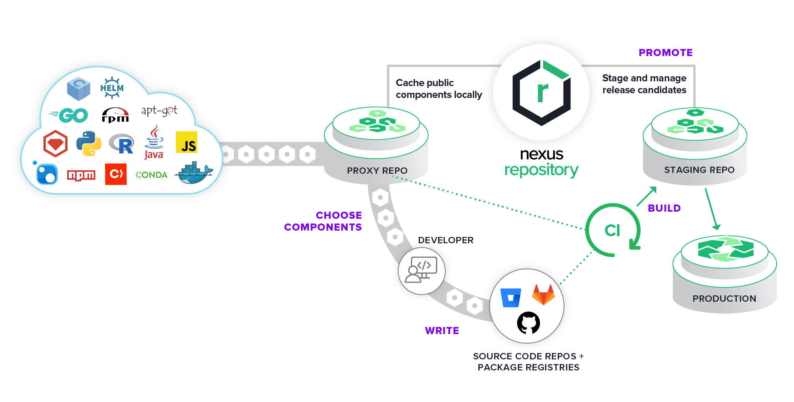
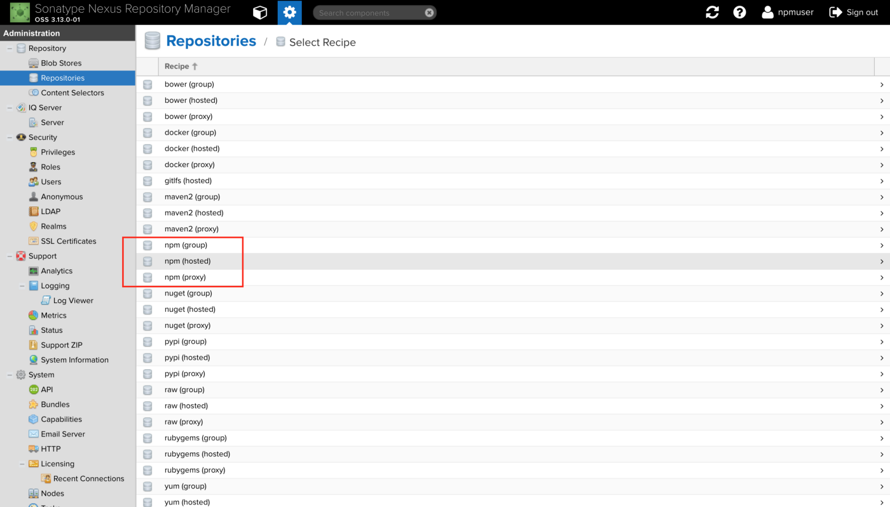
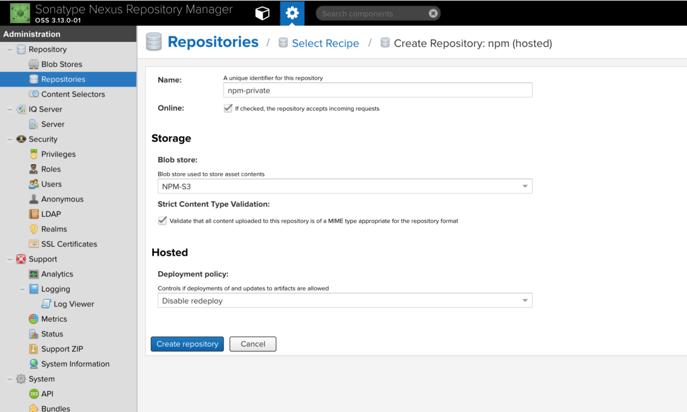
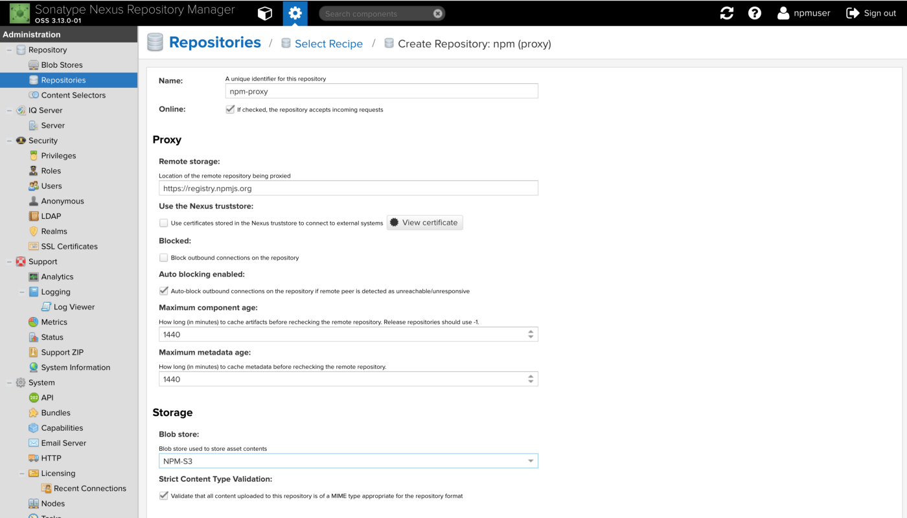
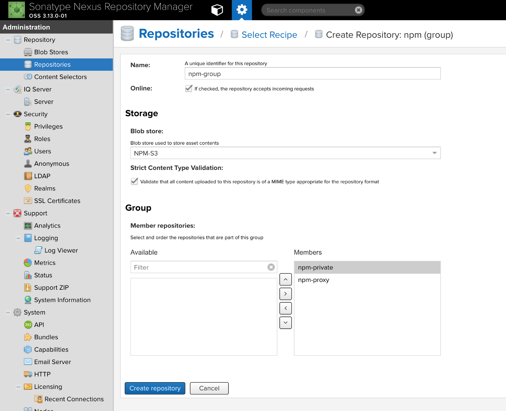
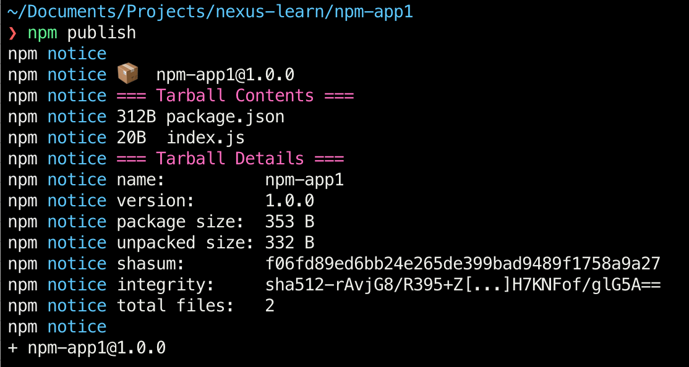
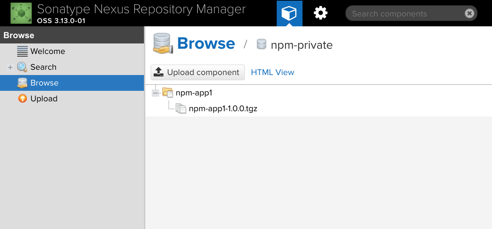

Atualmente trabalho com JavaScript e Node.js em uma grande operadora daqui do Brasil e muitas de nossas soluções não podem estar públicas na internet por questões de segurança.

No projeto que trabalho temos o costume de compartilhar módulos JavaScript entre microserviços para aumentar nossa produtividade.

Isso no levou a desenvolver muitas libs internas, até então estávamos utilizando um gitlab interno como repositório de pacote para essas libs, mas o processo de governança e publicação não ficou muito bom.

Por isso migramos para o Nexus Repository Manager (também conhecido como Nexus), que é um gerenciador de repositório de código aberto fornecido pelo Sonatype.

A nossa intenção é continuar usando o NPM e tudo aquilo que a comunidade JavaScript pode nos oferecer de open-source. Combinando com nossas libs privadas do Nexus, além de conseguir utilizar de maneira decente um processo de controle de pacotes.

Neste artigo vamos ver um resumo de porque escolhemos o Nexus como repositório privado, como configura-ló para funcionar com o NPM e como conseguir consumir os pacotes guardados no Nexus.

## Por que não estamos usando os produtos do NPM?

Bem, aqui a gente entra um pouco no processo de contratação de serviço da empresa, geralmente não se contrata ou compra serviços que vão atender a somente um time, como temos muitos projetos e muitos times trabalhando a empresa tenta contratar o serviço para o máximo de times possíveis.

No momento que estou escrevendo esse artigo o NPM a nível enterprise que possuí toda a estrutura de serviços que uma grande corporação precisa está custando ao **mês** 10 mil dólares.

Com 10 mil dólares nosso time de DevOps é capaz de subir toda infraestrutura necessária, configurar backups regulares, camadas de segurança e ainda vai sobrar bastante dinheiro porque o Nexus pode atender diversas plataformas de programação.



Se você só utiliza JavaScript em seus projetos e pode pagar pelos produtos oferecidos pelo NPM ou não possuiu um time que possa manter uma infraestrutura decente para você, recomendo optar pelo NPM.

## O mínimo que você precisa saber para prosseguir

O Nexus vai expor para você um repositório “publico” chamado `group` que internamente é combinação do nosso repositório privado, ou seja, `hosted` e um `proxy` para o registro público do NPM.

O proxy é extremamente importante se seu projeto precisa utilizar libs open source que estão hospedadas no NPM ou em qualquer outro repositório que não seja o teu Nexus.

Por padrão sempre que a gente consumir um pacote publico o Nexus vai criar um cache para que a gente não precise acessar o NPM a todo momento por exemplo.

No final de nossa configuração teremos a seguinte somatória `group = hosted + proxy` e nosso fluxo de uso será sempre baixar os pacotes do `group` e fazer uploads para o `hosted`.


No fim, vamos arregaçar um pouco as mangas e entender.

## Criando um repositório Host

Repositórios hospedados são os repositórios particulares que criamos para armazenar nossos pacotes particulares. O que torna esses repositórios privados é a incapacidade de ler o conteúdo desses repositórios sem um authToken. Veremos isso em um exemplo no final do artigo.

Para criar um repositório do tipo `hosted` vá em `Settings => Repository => Repositories => Create Repository`.

Depois de clicar em **Create Repository** o Nexus vai nos exibir uma quantidade enorme de plataformas que gerenciam dependências. Se for sua primeira vez usando Nexus, aproveite a oportunidade para da uma explorada no que a plataforma pode te oferecer.



Dessa lista vamos focar no **npm**, o primeiro repositório que vamos será `npm(hosted)`.

Na tela de criação o Nexus vai nos solicitar um nome **único** e em storage vamos guardar os nossos artefatos.

E é isso, basta clicar no botão **Create Repository** para finalizar.



## Criando um proxy e grupo do NPM

Volte novamente para `Repository => Repositories => Create Repository`, para criamos um novo repositório do tipo `npm(proxy)`.

Na tela de configuração nos vamos especificar que queremos nos comunicar com o NPM no campo **Proxy Location** adicionando a URL `https://registry.npmjs.org`.



Com os repositórios `npm(hosted) e npm(proxy)` criados, podemos finalmente criar o `npm(group)`.

O fluxo de configurações é igual aos anteriores, coloque um nome e informe o mesmo store utilizado em `npm(hosted) e npm(proxy)`.

Além disso precisamos selecionar os usuários ou grupos que podem acessar o repositório `npm(group)`.



## Enviando pacotes para o Nexus

Agora que estamos prontos com os repositórios criados, podemos configurar nossos projetos.

Para publicar um artefato no Nexus, precisamos alterar o arquivo **package.json** adicionando um objeto chamado **publishConfig** que vai guardar a **URL** do nosso repositório **privado**.

```
{
  "name": "@ms-ott/tools",
  "version": "2.0.4",
  "description": "Common and helpers tools to create microservices APIs",
  "main": "src/index.js",
  "publishConfig": {
    "registry": "https://meu.dominio.com/repository/npm-private/"
  },
  "scripts": {
    "lint": "eslint \"{src,apps,libs,test}/**/*.js\" --fix",
    "test": "jest",
    "test:watch": "jest --watch",
    "test:cov": "jest --coverage"
  },
  "devDependencies": {
    "eslint": "^5.16.0",
   "eslint-plugin-import": "^2.16.0",
    "eslint-plugin-prettier": "^3.0.1",
    "jest": "^24.7.1",
    "prettier": "^1.16.4"
  },
  "dependencies": {
    "aws-sdk": "^2.263.1",
    "dotenv": "^5.0.1",
    "dynamoose": "^1.7.3",
    "joi": "^13.4.0",
    "jsonwebtoken": "^8.5.1",
    "node-cache": "^4.2.0",
    "restify-cors-middleware": "^1.1.1",
    "restify-errors": "^8.0.1",
    "uuid": "^3.3.3",
    "request": "^2.83.0",
    "request-ip": "^2.1.3",
    "winston": "^3.2.1"
  }
}
```

Com o **package.json** configurado, agora precisamos fazer um login no npm cli apontando o **registry** para o nosso domínio:

`npm login —-registry=https://meu.dominio.com/repository/npm-private/`

Digite seu usuário e senha do nexus e pronto. 🧞

Agora basta executar o comando: `npm publish` .



Se tudo deu certo você vai conseguir verificar sua lib hospedado acessando o repositório privado.



## Baixando seus pacotes do Nexus

Agora que publicamos nossa lib no Nexus, vamos consumi-la em outros projetos.

Precisamos adicionar um arquivo **.npmrc** no projeto, para evitar que toda pessoa desenvolvedora do time precise fazer um npm login apontando o registry para o Nexus.

O arquivo **.npmrc** vai guardar tanto a URL do Nexus como um authToken com permissão de acesso.

#### Como boa prática, recomendo que você possua configurado em seu Nexus um usuário com permissão de somente leitura que possa ser usado para um fluxo de CI/CD e que você possa deixar o arquivo .npmrc versionado.

Para gerar o authToken você pode usar o comando abaixo:

`echo -n 'registryuser:registrypassword' | openssl base64`

Com o authToken em mãos, basta criar o arquivo como no modelo abaixo:

```
registry=https://meu.dominio/repository/npm-group
always-auth=true
_auth=bWF0ZXVzLm1hbGFxdWlhczoxMjM0NTY=
```

## Bônus: Usando Jenkins com Nexus

Se você assim como eu, possui um Jenkins privado e deseja que o teu fluxo de publicação seja automatizado. O código abaixo possui o mínimo necessário para publicar nossas libs usando o Jenkins.

```
pipeline {
    agent any
    tools{nodejs "node”}

    environment {
        REGISTRY_URL = "http://localhost:8081/repository/malaquias-npm-private/“
        REGISTRY_USER_EMAIL = "malaquiasdev@gmail.com”
        NPM_TOKEN = "bnBtdXNlcjpWbnRlaG1fMDU=“
    }

    stages {
        stage('Git Checkout') {
            steps {
                git 'https://gitlab.com/malaquiasdev/nexus-study.git'
            }
        }

        stage('Publish to Nexus') {
            steps {
                sh ‘ls'
                sh 'echo -e "registry=${REGISTRY_URL}\nemail=${REGISTRY_USER_EMAIL}\nalways-auth=true\n_auth=${NPM_TOKEN}" >> .npmrc’
                sh 'npm publish'
            }
        }
    }
```

## Conclusão

Nesse artigo pincelei um fluxo básico de como publicar e consumir libs privadas usando o Nexus Repository.

---

## Finalizando...

Se você gostou desse post, por favor não deixe de dar um like e compartilhar 😄

Se quiser saber o que ando fazendo por ai ou tirar alguma dúvida fique a vontade para me procurar nas redes sociais como @ [malaquiasdev](https://twitter.com/malaquiasdev) .

Para ler mais post meus acesse [MalaquiasDEV | A Vida, o código e tudo mais](http://malaquias.dev/) .
